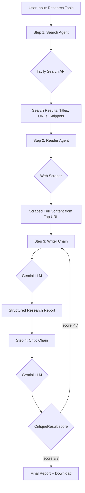

# 🔬 ResearchMind - Multi-Agent AI Research Assistant

<div align="center">


**An intelligent multi-agent system driven by a typed, graph-based LangGraph workflow that collaboratively researches any topic and generates comprehensive, well-cited reports.**

[Features](#-features) • [Architecture](#-architecture) • [Deployment](#-deployment) • [Usage](#-usage) • [API Keys](#-api-keys)

</div>

---

## 🌟 Features

- **🤖 Multi-Agent Collaboration**: Four specialized AI agents execute as nodes in a typed LangGraph StateGraph
- **🔍 Web Search Integration**: Uses Tavily API for high-quality web search results
- **📄 Deep Content Scraping**: Extracts full article content from relevant URLs
- **✍️ Intelligent Report Writing**: Generates structured, professional reports and revises them based on critic feedback
- **🧐 Quality Assurance**: Critic agent returns a structured Pydantic score, strengths, weaknesses, and one-line verdict
- **🔁 Conditional Revision Loop**: Automatically re-runs the writer on low-scoring reports until quality is accepted or the revision limit is reached
- **🎨 Beautiful UI**: Modern, responsive Streamlit interface with custom styling
- **📥 Downloadable Reports**: Export research reports as Markdown files

---

## 🏗️ Architecture

### System Components

```
┌─────────────────────────────────────────────────────────┐
│                     USER INTERFACE                       │
│                    (Streamlit App)                       │
└──────────────────┬──────────────────────────────────────┘
                   │
                   ▼
         ┌─────────────────────┐
         │  RESEARCH PIPELINE  │
         └─────────────────────┘
                   │
    ┌──────────────┼──────────────┬──────────┐
    ▼              ▼              ▼          ▼
┌────────┐   ┌────────┐   ┌────────┐   ┌────────┐
│ SEARCH │   │ READER │   │ WRITER │   │ CRITIC │
│ AGENT  │───│ AGENT  │───│ CHAIN  │───│ CHAIN  │
└────────┘   └────────┘   └────────┘   └────────┘
    │            │              │              │
    ▼            ▼              │              │
┌────────┐   ┌────────┐         │              │
│ Tavily │   │  Web   │         │              │
│   API  │   │Scraper │         │              │
└────────┘   └────────┘         │              │
                                ▼              ▼
                         ┌─────────────────────────┐
                         │   Google Gemini API     │
                         │  (gemini-2.5-flash)     │
                         └─────────────────────────┘
```

### Agent Workflow

Each step runs as a node in a LangGraph `StateGraph`, passing a typed `ResearchState` dict that carries the topic, search results, scraped content, draft report, structured critique, and revision count through the graph. The graph flows Search → Reader → Writer → Critic; after the Critic produces its structured score, a conditional edge routes back to Writer for one revision if the score is below 7, or forwards to END if the score is 7 or above.



---

## 🔄 Agent Pipeline Details

### 1️⃣ **Search Agent** 🔍
**Purpose**: Gathers recent web information on the research topic

**How it works**:
- Receives user's research query
- Calls Tavily Search API with the topic
- Returns top 5 search results with:
  - Page titles
  - URLs
  - Content snippets (300 chars each)
  
**Output**: Formatted list of relevant web resources

---

### 2️⃣ **Reader Agent** 📄
**Purpose**: Deep-dives into the most relevant source

**How it works**:
- Analyzes search results from Step 1
- Uses LLM to identify the most relevant URL
- Scrapes full webpage content using BeautifulSoup
- Cleans HTML (removes scripts, styles, nav, footer)
- Extracts up to 3000 characters of main content

**Output**: Clean, readable text from the best source

---

### 3️⃣ **Writer Chain** ✍️
**Purpose**: Drafts comprehensive research report, revising based on critic feedback when needed

**How it works**:
- Receives combined data from Search + Reader agents
- Uses Google Gemini 2.5 Flash model
- Follows structured prompt template:
  - Introduction
  - Key Findings (minimum 3 points)
  - Conclusion
  - Sources (all URLs cited)
- On a revision pass, incorporates the critic's identified weaknesses to improve the previous draft
- Generates detailed, factual, professional content

**Output**: Complete Markdown-formatted research report (initial draft or revised)

---

### 4️⃣ **Critic Chain** 🧐
**Purpose**: Quality assurance and improvement suggestions

**How it works**:
- Reviews the generated report
- Evaluates based on:
  - Clarity and structure
  - Factual accuracy
  - Depth of analysis
  - Source quality
- Returns a structured `CritiqueResult` Pydantic object (not free-form text)

**Output** (`CritiqueResult`):
- `score` — integer 1–10
- `strengths` — list of strength strings
- `weaknesses` — list of areas to improve (fed back to the writer on revision)
- `verdict` — one-line overall assessment

---

## 🛠️ Tech Stack

| Component | Technology |
|-----------|------------|
| **LLM Provider** | Google Gemini (gemini-2.5-flash) |
| **Agent Framework** | LangChain |
| **Frontend** | Streamlit |
| **Search API** | Tavily |
| **Web Scraping** | BeautifulSoup4, Requests |
| **Language** | Python 3.9+ |

---


## 📖 Usage

### Using the Streamlit Interface

1. **Enter Research Topic**
   - Type your topic in the input field
   - Example: "Quantum computing breakthroughs in 2025"

2. **Run Pipeline**
   - Click "⚡ Run Research Pipeline"
   - Watch real-time progress through 4 stages

3. **Review Results**
   - View search results (expandable)
   - Read scraped content (expandable)
   - **Final Report**: Main research output
   - **Critic Feedback**: Quality assessment

4. **Download Report**
   - Click "⬇ Download Report (.md)"
   - Save for later use or sharing

---

## 📁 Project Structure

```
Multi-Model-Research-Agent/
│
├── app.py                 # Streamlit web interface
├── agents.py              # Agent and chain definitions
├── tools.py               # Web search & scraping tools
├── pipeline.py            # CLI version of pipeline
├── requirements.txt       # Python dependencies
├── .env                   # Environment variables (create this)
├── .gitignore            # Git ignore rules
└── README.md             # This file
```

---

## 🔧 Configuration

### Customizing the LLM

Edit `agents.py` to change the model:

```python
# Change model
llm = ChatGoogleGenerativeAI(
    model="models/gemini-2.0-pro",  # or gemini-2.5-flash
    temperature=0.7,  # Adjust creativity (0-1)
    google_api_key=os.getenv("GEMINI_API_KEY")
)
```

### Adjusting Search Results

Edit `tools.py`:

```python
# Change number of search results
results = tavily.search(query=query, max_results=10)  # Default: 5

# Change scraping length
return soup.get_text(separator=" ", strip=True)[:5000]  # Default: 3000
```

---


## 📊 Example Output

### Input
```
Topic: "Impact of AI on healthcare in 2025"
```

### Output Structure
```markdown
# Research Report: Impact of AI on Healthcare in 2025

## Introduction
[AI's transformative role in modern healthcare...]

## Key Findings

### 1. Diagnostic Accuracy Improvements
[Detailed analysis with stats...]

### 2. Personalized Treatment Plans
[Evidence from research...]

### 3. Administrative Efficiency
[Cost savings and productivity gains...]

## Conclusion
[Summary of impacts and future outlook...]

## Sources
- [Title] - URL
- [Title] - URL
...
```

### Critic Feedback
```
Score: 8/10

Strengths:
- Well-structured with clear sections
- Backed by recent sources (2025 data)
- Balanced perspective on benefits/challenges

Areas to Improve:
- Could include more specific case studies
- Statistics need more context

One line verdict:
Comprehensive overview with solid evidence, could benefit from real-world examples.
```

---


